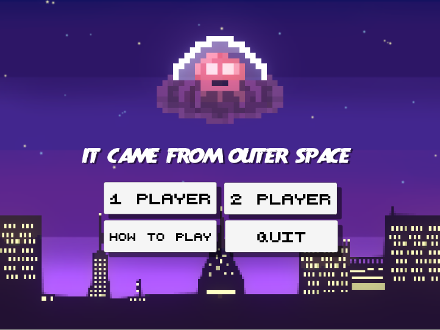
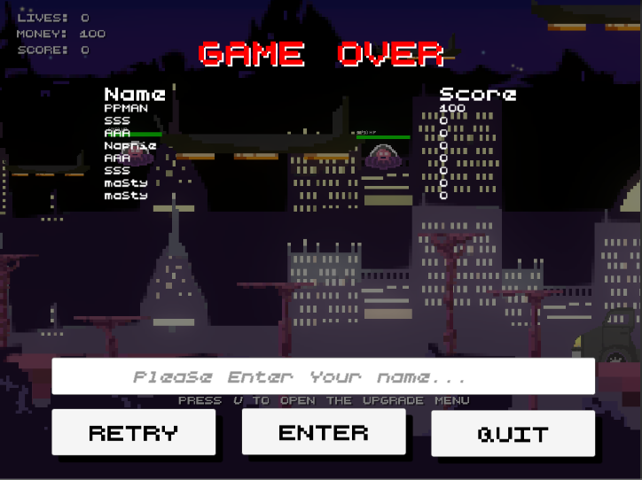
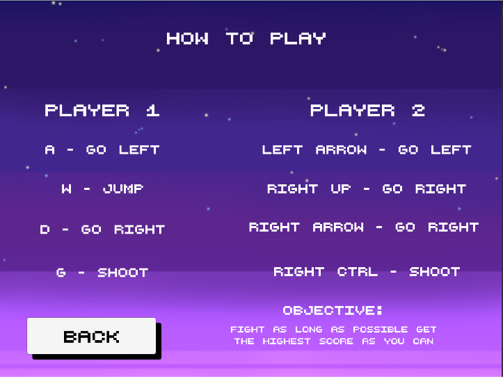

# It Came From Outer Space
### by Theeruth Borisuth and Charin Tantrakul
It Came From Outer Space is a 2D-Shooting Game that gamer will need to fight aliens from the outer space until gamers HP reaches 0. The player will be periodically provided random power-up for a short duration. Once the game ended, the screen will be automatically switched to the scoreboard screen. That allows player enter their own name then players name and score will record in the database and show only 10 players name that has the most score. And the game can switch to 2-Player. If one of player died, the game will end and switch to scoreboard screen.  
###### For the program's proposal [here](https://docs.google.com/document/d/1Yl1HFMUCixDSfxFESuwKqbjIp_hejp6r78KKKTdeAxc/edit).

###### For Documentation online [here](https://masty123.github.io/ItCameFromOuterSpace/).

Single Player

Two Player

Main menu

Game Over

### Design Pattern used
- Singleton - the singleton pattern is a software design pattern that restricts the instantiation of a class to one object. This is useful when exactly one object is needed to coordinate actions across the system. [Read more about Singleton design pattern](https://en.wikipedia.org/wiki/Singleton_pattern)

### Installation
Download the zip file

| PC | MacOS |Linux|
|:----------------:|:-----------:|:-----------:|
|[here](https://github.com/masty123/ItCameFromOuterSpace/blob/master/RunnableZip/PC.zip)         |[here](https://github.com/masty123/ItCameFromOuterSpace/blob/master/RunnableZip/Mac.zip)   |[here](https://github.com/masty123/ItCameFromOuterSpace/blob/master/RunnableZip/Linux.zip)|

 Install the file
 - For PC - Extract and run the .exe file.
 - For MacOS - Extract and run the .app file.
 - For Linux - Extract -> Go to the extracted folder -> Right click at the execution file (Linux.x86 (32 bit) or Linux.x86_64 (64 bit)) -> Go to properties -> Go to Permission tab -> At Execute, tick "Allow executing file as program".

### How To Play

